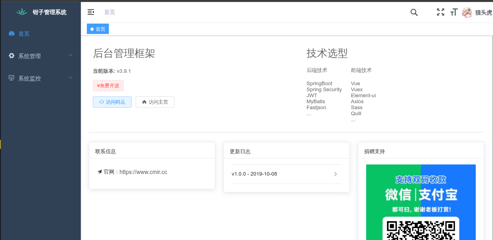
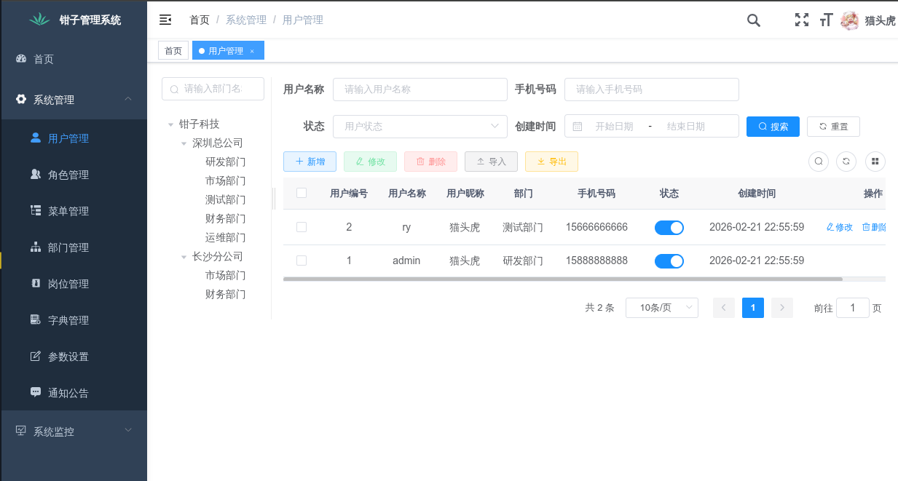

# 后台权限管理系统

> 基于ruoyi的二改精简版。
>
> 基于去IOE(IBM, Oracle, EMC)的原则，希望大家也本着去除国内vendor的绑定实现，重回开源思潮。
>
> 1. 不实现多模块
> 2. 不实现多数据源
> 3. 删除代码生成
> 4. 删除swagger
> 5. 删除数据库监控
> 6. 使用springboot 4新特性，譬如 虚拟线程
> 7. 修改大部分不符合sonar code的实现





## 前提条件

- OpenJDK 25
- Postgresql
- Redis

## 快速开始

1. 启动redis

```shell
docker run --name redis -p 6379:6379 --restart=always -d redis:latest redis-server --requirepass "P@ssw0rd"

```

2. 启动postgres

```shell
docker run --name postgres -p 5432:5432 -e POSTGRES_PASSWORD=P@ssw0rd --restart=always -d postgres:latest
```

或者直接使用docker-compose启动数据库和缓存。

```shell
docker-compose up -d
```

## 启动项目

1. 启动后端

```shell
mvn clean install
mvn spring-boot:run
```

2. 启动前端

```shell
cd ruoyi-ui
npm install
npm run serve
```

## 访问地址

- 后端：http://localhost:8080
- 前端：http://localhost:1024


# 后续工作

1. 准备JPA版本


